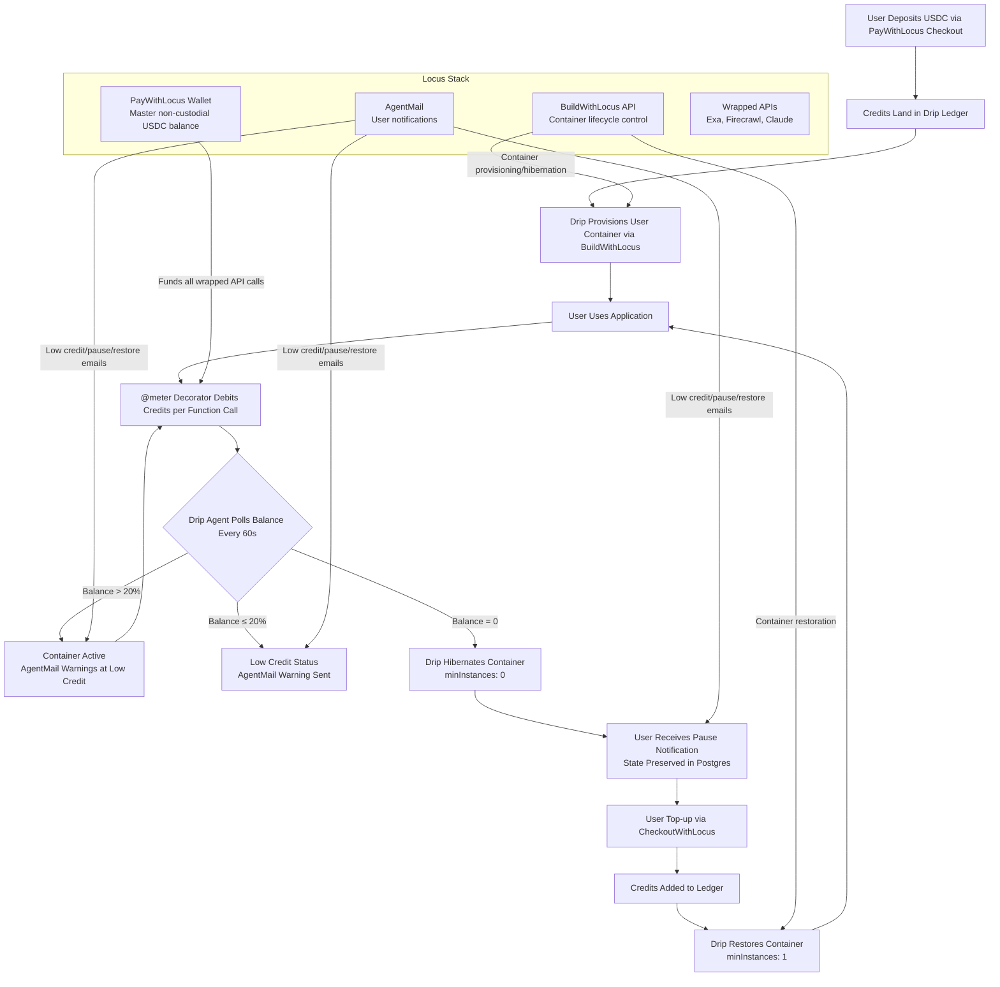

# Drip: Pay-as-you-go Compute Infrastructure for SaaS Developers


[](https://pypi.org/project/locus-drip/)

---

## What Drip Is

Drip is a middleware layer that transforms subscription-based SaaS into pay-per-use utilities. It sits between your application code and BuildWithLocus's container infrastructure, metering compute usage and billing users in real USDC.

The core innovation: developers deploy their app once via BuildWithLocus, and Drip automatically creates isolated containers for each user. By leveraging PayWithLocus and CheckoutWithLocus, it enables users to deposit USDC credits to pay for compute usage. When a user deposits credits, their container spins up. When credits drain to zero, the container hibernates. When they top up, it resumes instantly. Users pay only for compute they actually consume—no monthly subscription waste. The Drip agent and AgentMail work together to intelligently make decisions based on financial state and user behavior.

### Technical Elevator Pitch

```python
from drip import DripClient, DripConfig

client = DripClient(DripConfig(
    locus_api_key="your_locus_key",
    bwl_api_key="your_bwl_key",
))

@client.meter(cost=0.007, event="search")
async def expensive_search(query: str, user_id: str):
    return await exa.search(query)
```

Decorate any function. Credits drain when it runs. Drip handles container provisioning, credit tracking, hibernation warnings, and instant restoration. You ship the product.

---

## The Problem Drip Solves

### The Subscription Trap

Monthly SaaS subscriptions force users to pay for calendar months, not usage. Light users subsidize heavy users. Customers churn because they forget to cancel. Developers eat API costs for inactive users.

Example: A $29/month AI research tool. User logs in twice that month. They paid $29 for $0.80 of actual compute. **93% wasted.**

### The Infrastructure Tax

Even with modern PaaS like BuildWithLocus, you still pay for idle containers. If a user doesn't log in for a week, their container sits idle, consuming resources and costing money.

### The Monetization Gap

Most developers lack the plumbing to accept USDC payments, meter API calls, and manage container lifecycles based on financial state. They either build bespoke billing systems or stick with subscriptions.

---

## How Drip Works: The Technical Lifecycle



### The Loop Explained

1. **Deposit**: Users deposit USDC via CheckoutWithLocus. Credits land in Drip's internal ledger (PostgreSQL/SQLite).
2. **Provision**: Drip calls BuildWithLocus API to provision a dedicated container for that user. Environment variables inject `USER_ID`, `LOCUS_API_KEY`, etc.
3. **Run**: User interacts with app. Functions decorated with `@meter` debit credits per execution.
4. **Monitor**: Drip's agent loop polls user balances every 60 seconds. It computes the delta between local ledger and master wallet balance.
5. **Decide**: 
   - **Balance > 20%**: Container stays active. AgentMail warns at 20% threshold.
   - **Balance ≤ 20%**: Low credit status. AgentMail warning sent.
   - **Balance = 0**: Container hibernated (`minInstances: 0`). State preserved in Postgres.
6. **Notify**: User receives pause notification via AgentMail.
7. **Top-up**: User deposits more USDC via CheckoutWithLocus.
8. **Restore**: Drip restores container (`minInstances: 1`), triggers new deployment.

The loop is autonomous. The agent makes decisions based on financial state, not developer intervention.

---

## Installation & Setup Guide

### Quick Start (5-minute Integration)

```bash
pip install locus-drip
```

```python
from drip import DripClient, DripConfig

# Initialize with Locus credentials
client = DripClient(DripConfig(
    locus_api_key="claw_dev_...",      # From Locus dashboard
    bwl_api_key="claw_dev_...",        # From BuildWithLocus
    agentmail_inbox="your_inbox@agentmail.to",
))

# Meter any expensive function
@client.meter(cost=0.007, event="exa_search")
async def search(query: str, user_id: str):
    return await exa.search(query)

# Provision a user (spins container, sets up wallet)
await client.provision_user(
    user_id="user_abc",
    email="user@example.com",
    initial_balance=5.0,  # Starting USDC credits
)

# Drip handles everything else:
# ✓ Balance polling every 60s
# ✓ Container hibernation at $0
# ✓ Instant restore on top-up
# ✓ AgentMail low-credit warnings
# ✓ Itemized usage receipts
```

### Environment Setup

```bash
# Clone repository
git clone https://github.com/0xshae/drip
cd drip

# Install dependencies
pip install -r requirements.txt
pip install -e ./sdk

# Set environment variables
export LOCUS_API_KEY="your_locus_key"
export BWL_API_KEY="your_bwl_key"
export AGENTMAIL_INBOX="your_inbox@agentmail.to"
```

### Deploy to BuildWithLocus

```bash
# Push to GitHub
git push origin main

# Deploy via BWL CLI (or API)
bwl deploy --env production

# Or use direct API
curl -X POST "https://beta-api.buildwithlocus.com/v1/deployments" \
  -H "Authorization: Bearer $BWL_TOKEN" \
  -d '{"serviceId": "your_service_id"}'
```

---

## API Usage

### Core Methods

```python
# User lifecycle management
await client.provision_user(
    user_id="user_abc",
    email="user@example.com",
    initial_balance=5.0,
    container_image="your-bwl-image:latest",  # Optional: auto-provision container
    metadata={"topic": "AI research"}         # Optional: context for notifications
)

# Get user state
user = await client.get_user("user_abc")
# Returns: {"user_id": "...", "balance_usdc": 3.42, "status": "active", ...}

# Manual debit (alternative to @meter)
await client.debit("user_abc", 0.01, "joke_generated")

# Manual lifecycle control
await client.hibernate("user_abc")    # Force pause
await client.restore("user_abc")      # Force resume

# Top-up (auto-restores if paused)
await client.topup("user_abc", 2.0)   # Add 2.0 USDC
```

### Meter Decorator Deep Dive

```python
# Basic usage
@client.meter(cost=0.007, event="search")
async def search(query: str, user_id: str):
    ...

# With custom user_id parameter name
@client.meter(cost=0.05, event="llm_call", user_id_param="customer_id")
async def llm_call(prompt: str, customer_id: str):
    ...

# Global decorator (after drip.configure())
from drip import meter

@meter(cost=0.01, event="image_gen")
async def generate_image(prompt: str, user_id: str):
    ...
```

The decorator:
1. Extracts `user_id` from kwargs (default param name `user_id`)
2. Calls `client.debit()` with specified `cost` and `event` label
3. Executes wrapped function
4. Raises `DripInsufficientCredits` if balance insufficient

---

## BuildWithLocus & PayWithLocus Integration Depth

### BuildWithLocus: Container Orchestration

Drip uses BWL as its container runtime layer:

```python
# Provision container (actual implementation)
result = await lifecycle.provision_container(
    bwl_api_base="https://beta-api.buildwithlocus.com",
    bwl_api_key=bwl_key,
    user_id=user_id,
    container_image="your-app:latest",
    env_vars={
        "USER_ID": user_id,
        "LOCUS_API_KEY": locus_key,
        "LOCUS_API_BASE": "https://beta-api.paywithlocus.com/api",
        "AGENTMAIL_INBOX": agentmail_inbox,
    }
)

# Hibernate (scale to zero)
await lifecycle.hibernate_container(
    bwl_api_base, bwl_key, service_id
)

# Restore (scale to one)
await lifecycle.restore_container(
    bwl_api_base, bwl_key, service_id
)
```

Technical details:
- Each user gets dedicated project (`drip-{user_id[:8]}`)
- Production environment created automatically
- Service configured with `minInstances: 1` (active), `minInstances: 0` (hibernated)
- Environment variables injected for runtime awareness

### PayWithLocus: Payment Infrastructure

Drip uses PWL for three critical functions:

1. **Master Wallet Balance**: All wrapped API calls (Exa, Firecrawl, Claude) are billed through a master non-custodial wallet. Drip monitors this balance to ensure platform solvency.

```python
async def check_master_wallet_balance(api_base: str, api_key: str) -> float:
    """Check master Drip wallet balance via PayWithLocus API."""
    resp = await client.get(f"{api_base}/pay/balance",
        headers={"Authorization": f"Bearer {api_key}"})
    data = resp.json().get("data", {})
    usdc = float(data.get("usdc_balance", "0"))
    promo = float(data.get("promo_credit_balance", "0"))
    return usdc + promo
```

2. **Checkout Sessions**: Drip generates CheckoutWithLocus sessions for user top-ups. Webhooks map payment IDs to internal user accounts.

3. **Webhook Verification**: All incoming payment signals are verified using HMAC-SHA256 signatures to prevent credit injection attacks.

---

## Agent Architecture & Product Design

### The Drip Agent: Financial Brain for Autonomous Systems

Drip isn't just middleware—it's an agent making real decisions about your users' runtime.

```python
async def start_polling(self):
    """Background polling loop — the agent's core."""
    while True:
        users = await state.get_active_users()
        for user in users:
            pct = user["balance_usdc"] / max(user["initial_balance"], 0.01)
            
            if pct <= 0 and user["status"] == "active":
                await self.hibernate(user_id)
                await send_agentmail_warning(...)
            elif 0 < pct <= 0.2 and user["status"] == "active":
                await state.set_status(user_id, "low_credit")
                await send_agentmail_warning(...)
        
        # Master wallet audit (every 10 cycles)
        master_balance = await wallet.check_master_wallet_balance(...)
        if master_balance < 1.0:
            await state.add_log(None, "⚠️ CRITICAL: master wallet below $1.00")
```

The agent:
- **Polls continuously**: 60-second intervals (configurable)
- **Makes threshold decisions**: 20% warning, 0% hibernation
- **Audits master wallet**: Ensures platform solvency
- **Sends proactive notifications**: Via AgentMail
- **Self-recovers**: Exception handling with continue

### State Preservation During Hibernation

When a container hibernates (`minInstances: 0`), Drip preserves:
- User balance and transaction history in Postgres
- Container metadata (`service_id`, `project_id`, `environment_id`)
- Operational logs (every debit, provision, lifecycle transition)
- Application state (via your app's persistence layer)

Restoration is instant because BuildWithLocus maintains the container image and environment variables. The container resumes from the exact same state.

---

## Demo Product: Research Agent Explained

### What It Demonstrates

The research agent is a fully functional Drip implementation:
- Uses wrapped Exa API for search ($0.007 per call)
- Uses wrapped Firecrawl API for scraping ($0.001 per scrape)
- Uses wrapped Claude API for synthesis ($0.12 per synthesis)
- Budget-aware: stops when credits depleted
- Auto-hibernates: container pauses at $0 balance
- Auto-restores: resumes on top-up

### Underneath the Demo

```python
# research/main.py — actual implementation
@client.meter(cost=0.007, event="exa_search")
async def search_web(query: str, user_id: str):
    return await exa.search(query)

@client.meter(cost=0.001, event="firecrawl_scrape")
async def scrape_url(url: str, user_id: str):
    return await firecrawl.scrape(url)

@client.meter(cost=0.12, event="claude_synthesis")
async def synthesize(content: str, user_id: str):
    return await claude.complete(content)

# Budget enforcement
async def run_research_cycle(user_id: str, topic: str, budget: float):
    remaining = await state.get_user(user_id)["balance_usdc"]
    if remaining <= 0:
        return {"status": "paused", "reason": "no credits"}
    
    # Agent makes tradeoffs: fewer sources if budget low
    num_sources = min(5, int(remaining / 0.05))
    ...
```

The demo shows:
1. **Real billing**: Every API call debits real USDC from master wallet
2. **Real notifications**: AgentMail sends low credit warnings
3. **Real lifecycle**: Container hibernates at $0, restores on top-up
4. **Real tradeoffs**: Agent reduces crawl depth (5→2) to extend runtime

---

## Security Architecture

### Threat Model & Mitigations

1. **Credit Injection Attacks**
   - Mitigation: Webhook verification with HMAC-SHA256 signatures
   - Implementation: All CheckoutWithLocus webhooks validated before credit allocation

2. **API Key Exposure**
   - Mitigation: Environment variable management, never exposed client-side
   - Implementation: Locus and BWL keys injected as container env vars, not in code

3. **Balance Manipulation**
   - Mitigation: Atomic database transactions, audit logging
   - Implementation: Every debit logged with timestamp, user_id, amount, event

4. **Container Hijacking**
   - Mitigation: Per-user isolation, no shared state
   - Implementation: Each user gets dedicated BWL project and service

5. **Master Wallet Drain**
   - Mitigation: Continuous auditing, threshold warnings
   - Implementation: Agent polls master wallet every 600 seconds, logs if < $1.00

### Webhook Verification Implementation

```python
# locusmeter/webhooks.py — actual implementation
async def verify_webhook_signature(payload: bytes, signature: str, secret: str):
    """HMAC-SHA256 verification of Locus webhooks."""
    expected = hmac.new(
        secret.encode(), payload, hashlib.sha256
    ).hexdigest()
    return expected == signature

@app.post("/webhook/checkout-paid")
async def checkout_paid(request: Request):
    sig = request.headers.get("X-Locus-Signature")
    body = await request.body()
    
    if not verify_webhook_signature(body, sig, WEBHOOK_SECRET):
        raise HTTPException(401, "Invalid signature")
    
    # Only then apply credits
    await client.topup(user_id, amount)
```

---

## Tech Stack

| Layer | Technology | Purpose |
|-------|------------|---------|
| **SDK** | Python 3.10+, FastAPI | Developer interface, async decorators |
| **Database** | SQLite (demo), PostgreSQL (prod) | User ledger, audit logs, state persistence |
| **Payments** | PayWithLocus, CheckoutWithLocus | USDC acceptance, checkout sessions |
| **Infrastructure** | BuildWithLocus | Container provisioning, lifecycle control |
| **Notifications** | AgentMail | Low credit warnings, lifecycle alerts |
| **AI APIs** | Locus-wrapped Exa, Firecrawl, Claude | Metered AI services |
| **Frontend** | Astro, Tailwind CSS | Landing page, documentation |
| **Deployment** | Vercel, BWL auto-deploy | Production hosting |

### Badges for Implementation


---

## Business Plan: B2B2C Monetization Strategy

### Three Revenue Streams

1. **Platform Fee (B2B)**
   - Drip charges 5% on credits consumed through the middleware
   - Example: User spends $10 on compute → Drip earns $0.50
   - Scale: 1000 users spending $10/month → $500/month platform revenue

2. **Compute Markup (B2C → B2B)**
   - Developers using Drip set their `@meter` costs higher than raw API costs
   - Example: Exa search costs $0.005 raw, developer charges $0.007
   - Margin: $0.002 per search → developer profit
   - Drip enables this markup without billing infrastructure

3. **Enterprise Tier (B2B)**
   - Managed Drip hosting with:
     - Advanced audit logging
     - Multi-wallet spending controls
     - SLA guarantees
     - Dedicated support
   - Pricing: $499/month + 3% platform fee

### Market Positioning

**Target Customers:**
1. **AI SaaS Developers**: Building research tools, chat interfaces, content generators
2. **Developer Tool Creators**: CLIs, internal agents, pipelines with episodic usage
3. **Data Processing Companies**: ETL jobs, report generators, analytics platforms
4. **ML/AI Teams**: Experiment tracking, model training with burst GPU usage

**Value Proposition:**
- **For Developers**: Monetization infrastructure in 5 minutes, no billing code
- **For Users**: Pay only for what they use, no subscription waste
- **For Platforms**: Higher retention (no churn from forgotten cancellations)

### Unit Economics

| Metric | Calculation | Example |
|--------|------------|---------|
| **User LTV** | (Monthly spend × Retention rate × Months) | $8/month × 90% retention × 12 months = $86.40 |
| **Developer Revenue** | (User LTV × Number of users) | 100 users × $86.40 = $8,640/year |
| **Drip Platform Revenue** | (Developer Revenue × 5%) | $8,640 × 5% = $432/year |
| **Enterprise Revenue** | ($499/month × Enterprise count) | 10 enterprises × $499/month = $4,990/month |

---

## Future Steps: Drip as Middleware Product

### Short-term (3 months)

1. **Dynamic Pricing Engine**
   - Agents adjust `@meter` costs based on compute difficulty
   - Market-based pricing: higher costs during peak demand
   - API: `@client.meter(dynamic=True, base_cost=0.01)`

2. **Multi-Tenant Dashboard**
   - Self-serve portal: users manage balances across multiple apps
   - Developer dashboard: real-time analytics, user spend reports
   - Admin dashboard: platform fee tracking, wallet management

3. **Entitlement Gating**
   - Feature-based access: "Tier 1 gets GPT-4, Tier 2 gets GPT-4o"
   - Usage caps: "Maximum 100 searches/month"
   - Rate limiting: "10 calls/minute" enforced by credits

### Medium-term (6 months)

1. **Cross-Platform Support**
   - AWS Lambda, Google Cloud Run, Vercel Edge Functions
   - Same `@meter` decorator, different backend infrastructure

2. **Credit Marketplace**
   - Users trade credits between different Drip-powered apps
   - Developers offer credit bundles as promotional tools
   - Secondary market: buy/sell credits based on usage patterns

3. **Agent-to-Agent Payments**
   - Autonomous agents pay each other for services
   - Example: Research agent pays summarization agent for synthesis
   - Smart contract integration for cross-agent settlements

### Long-term (12 months)

1. **Drip as Protocol**
   - Open standard for pay-per-use compute
   - Other platforms implement Drip-compatible middleware
   - Interoperability between different infrastructure providers

2. **Decentralized Infrastructure Pool**
   - Users contribute compute resources to shared pool
   - Credits represent compute time, not just USDC
   - Blockchain-based settlement for cross-provider payments

3. **Autonomous Economic Agent**
   - Drip itself runs on credits it manages
   - Agent has economic incentives to optimize runtime efficiency
   - Self-funding architecture: survives only while providing value

---

## Known Issues & Constraints

### Current Limitations

1. **Polling Frequency**
   - Default 60-second intervals may miss rapid balance changes
   - High-frequency apps (>100 calls/minute) need webhook-based sync
   - Mitigation: Configurable `poll_interval_seconds` (down to 10s)

2. **Concurrency Scaling**
   - Demo uses SQLite; production needs PostgreSQL
   - High-volume concurrent metering (>1000 users) requires connection pooling
   - Mitigation: PostgreSQL support built-in, async connection management

3. **Container Startup Time**
   - BuildWithLocus containers take ~30-60 seconds to provision
   - Hibernation/restoration triggers new deployment (~45 seconds)
   - Mitigation: Pre-warming strategies, standby containers for premium tiers

4. **Master Wallet Dependency**
   - All wrapped API calls depend on master wallet balance
   - If master wallet drains, all user API calls fail silently
   - Mitigation: Continuous auditing, auto-refill triggers, multi-wallet fallback

### Edge Cases

1. **Race Conditions**
   - Concurrent debits from same user may overspend
   - Mitigation: Database transactions, balance checks before debit

2. **Webhook Failures**
   - CheckoutWithLocus webhooks may delay or fail
   - Mitigation: Polling backup, manual credit adjustment API

3. **Notification Spam**
   - Low credit warnings every 60 seconds if balance stagnant
   - Mitigation: Cooldown periods, smart notification scheduling

---

## What Else Can Be Built With This Stack

### Alternative Applications

1. **Developer CLI Monetization**
   - Command-line tools that charge per invocation
   - Example: `$ drip-cli analyze --cost 0.01` debits credits
   - Use case: Internal tools, DevOps pipelines, code generators

2. **API Gateway with Metering**
   - REST/GraphQL API gateway that meters every endpoint
   - Developers define costs per endpoint (`/search: $0.007`, `/synthesize: $0.12`)
   - Use case: Microservices, B2B APIs, partner integrations

3. **GPU Compute Marketplace**
   - ML training jobs priced by GPU-minute
   - Users submit jobs with credit budget, get results when budget exhausted
   - Use case: Model training, inference services, rendering pipelines

4. **Data Pipeline Orchestration**
   - ETL jobs that run until credits depleted
   - Dynamic scaling: more workers if budget high, fewer if budget low
   - Use case: Analytics platforms, real-time processing, batch jobs

5. **Multi-Agent Economic System**
   - Agents pay each other for specialized services
   - Research agent pays summarization agent, pays visualization agent
   - Use case: Autonomous agent ecosystems, agentic workflows

### Technical Extensions

1. **Credit Derivatives**
   - Time-based credits: "1 hour of compute" vs "100 API calls"
   - Budget smoothing: "Pay $10/month, get $15 worth of credits"
   - Advanced billing: amortized costs, usage predictions

2. **Infrastructure Abstraction**
   - Same Drip middleware on AWS, GCP, Azure, BWL
   - Developers choose infrastructure, Drip handles monetization
   - Cloud marketplace integration

3. **Regulatory Compliance**
   - Tax reporting: automated transaction logs for accounting
   - KYC/AML integration for enterprise users
   - Audit trails for financial compliance

---

## Team Details

### Core Team

**Shae (0xshae)** — Technical Lead & Product Architect
- Expertise: Blockchain infrastructure, agentic systems, Python middleware
- Previous: Multiple ETHGlobal hackathons, Solana Breakpoint finalist
- Role: SDK development, Locus stack integration, agent architecture

**Contributors**
- Open to collaboration from Locus ecosystem developers
- Seeking integration specialists for AWS/GCP/Azure support
- Community moderators for developer support channels

### Development Philosophy

**Build in Public**
- All code open source (MIT License)
- Regular updates on Twitter (@0xshae)
- Developer-centric documentation

**Agent-First Design**
- Systems designed for autonomous operation
- Economic incentives baked into architecture
- "Sleep and wake" as core principle

**Locus-Native**
- Deep integration with Locus stack
- No abstraction layers where unnecessary
- Leverage platform strengths directly

---

## Licensing

### Code License
- **MIT License** — Full open source, commercial use permitted
- Attribution required in derivative works
- No warranty, no liability

### Commercial Use
- Developers may use Drip SDK in commercial products
- Platform fee applies if using Drip managed service
- Enterprise tier requires separate agreement

### Contribution Guidelines
1. Fork repository
2. Make changes in feature branch
3. Submit pull request with:
   - Description of change
   - Test coverage (if applicable)
   - Documentation updates

### Intellectual Property
- Drip SDK is open source
- Drip managed service is proprietary
- Brand assets (logo, name) trademarked

---

## Getting Help & Community

### Support Channels
- **GitHub Issues**: Bug reports, feature requests
- **Twitter**: @0xshae for announcements, updates
- **Email**: shagun.prasad28@gmail.com for direct inquiries

### Documentation
- **SDK Docs**: `python -m pydoc locus_drip`
- **API Reference**: `/docs` endpoint on deployed service
- **Tutorials**: Example implementations in `sdk/examples/`

### Contributing
- **Code**: Python SDK, FastAPI endpoints, database models
- **Documentation**: README improvements, tutorial creation
- **Integration**: AWS/GCP/Azure support, additional Locus services

---

## Acknowledgments

### Locus Stack
Thanks to the Locus team for providing:
- BuildWithLocus — container infrastructure
- PayWithLocus — payment plumbing
- CheckoutWithLocus — checkout sessions
- AgentMail — notification system
- Wrapped APIs — Exa, Firecrawl, Claude

### Hackathon Support
Built for **Paygentic Hackathon Series — Week 2 & 3**
Special thanks to hackathon organizers, judges, and fellow builders.

### Open Source Community
Drip builds on:
- FastAPI — async web framework
- SQLite/PostgreSQL — database layer
- Python decorators — metering implementation
- HMAC-SHA256 — security verification

---

## Ready to Drip?

```bash
pip install locus-drip
```

Visit **[drip-landing-sooty.vercel.app](https://drip-landing-sooty.vercel.app)** for the live demo.

Follow **[@0xshae](https://twitter.com/0xshae)** for updates.

Start building pay-per-use applications today.